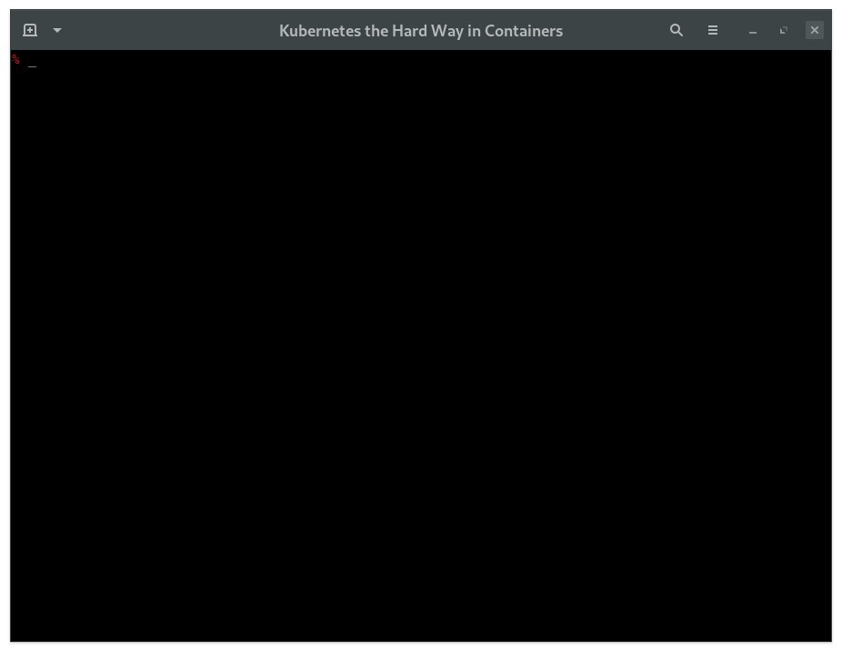

# KTHW 14 Cleaning Up



View the [screencast file](../screencasts/kthw-14.scr)

```
# ---------------------------------------------------------
# Kubernetes the Hard Way - using `mokctl` from My Own Kind
# ---------------------------------------------------------
# 14-cleanup.md
# Cleaning Up

# Delete the cluster:
mokctl delete cluster kthw
y
# Delete the docker container:
docker stop kthw
docker rm kthw
# Delete the certs directory:
rm -rf kthw-certs
# Delete the pod network routes:
ip ro | grep 10.200 | xargs -d'\n' -n1 sudo bash -c eval ip ro del

# All done :)

# ---------------------------------------
# You made it!! All finished - well done!
# ---------------------------------------
```
