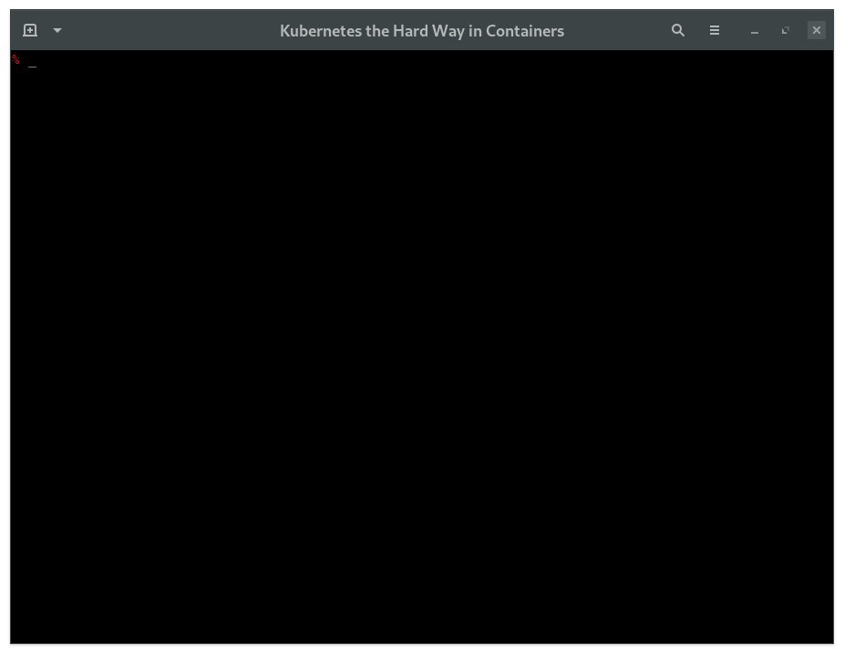

# KTHW 06 Generating the Data Encryption Config and Key



View the [screencast file](../screencasts/kthw-6.scr)

```
# ---------------------------------------------------------
# Kubernetes the Hard Way - using `mokctl` from My Own Kind
# ---------------------------------------------------------
# 06-generating-the-data-encryption-config-and-key
# Create encryption config and key

# We need to log back into the docker container, 'kthw', then
# paste the command blocks
docker exec -ti kthw bash

# The Encryption Key

# Set the encryption key variable
ENCRYPTION_KEY=$(head -c 32 /dev/urandom | base64)
echo $ENCRYPTION_KEY

# Need to be in the directory where the certs are so it can be
# copied from the host later on
cd /certs

# The Encryption Config File

cat > encryption-config.yaml <<EOF
kind: EncryptionConfig
apiVersion: v1
resources:
  - resources:
      - secrets
    providers:
      - aescbc:
          keys:
            - name: key1
              secret: ${ENCRYPTION_KEY}
      - identity: {}
EOF
ls -lh *.yaml

# Copy the encryption-config.yaml encryption config file to each
# controller instance:

# We need to log out of this container then copy the encryption
# key to the kubernetes master nodes
exit
# The encryption key should be in the kthw-certs directory
ls kthw-certs/*.yaml
# It is, good! Let's have a quick look at it:
cat kthw-certs/*.yaml
# Now to copy it to the Masters:
cd kthw-certs
# Copy to the masters
for instance in kthw-master-1 kthw-master-2 kthw-master-3; do
  sudo docker cp encryption-config.yaml ${instance}:/root
done
# All done :)

# ------------------------------------
# Next: Bootstrapping the etcd Cluster
# ------------------------------------
```
